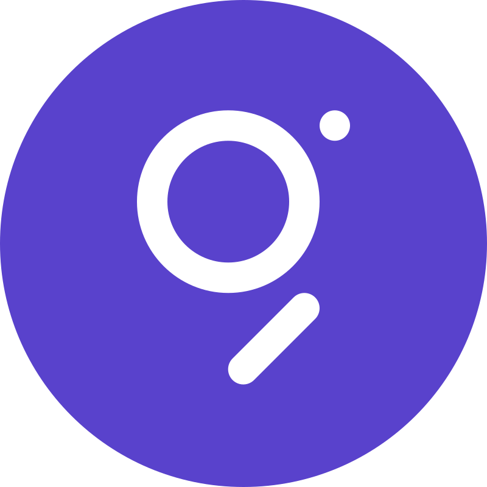

# rendura



A simple game engine written in Go from scratch. No external graphics libraries — just Go, with Ebitengine as a backend reference.

Inspired by Pico-8 and TIC-80. Built to understand how game engines actually work.

## Why

Most game engines hide everything behind abstraction layers. Rendura starts from the pixel. Want to know how a color palette works? It's right there. Curious about how shapes get drawn to a screen buffer? Everything is explicit.

This is a learning project and a working engine. It prioritizes clarity over convenience.

## What Works

- Pixel-perfect 64-color palette (6-bit RGB)
- Shapes: rectangles, filled rectangles, lines, circles, filled circles
- Sprites with transparency
- Keyboard, mouse, and gamepad input
- Basic audio (WAV decoding, sample playback)
- GUI elements for tooling
- WASM support

## Quick Start

```bash
go get github.com/bauerceptor/rendura
```

```go
package main

import (
    "github.com/bauerceptor/rendura"
    "github.com/bauerceptor/rendura/rendura_cofont"
    "github.com/bauerceptor/rendura/rendura_ebiten"
)

func main() {
    rendura.SetScreenSize(47, 9)
    rendura.Draw = func() {
        rendura_cofont.Print("HELLO WORLD", 2, 2)
    }
    rendura_ebiten.Run()
}
```

## Examples

The `rendura_examples` directory has working examples:

- `hello` — minimal setup
- `shapes` — drawing primitives with mouse interaction
- `snake` — a complete game
- `gui` — UI tree structure
- `gamepad` — controller input
- `audio/piano` and `audio/lowlevel` — sound playback

## Technical Notes

- **Not thread-safe.** Performance requires it. All rendering happens on a single goroutine.
- **Fixed color palette.** 64 simultaneous colors on screen, indexed by table.
- **No external dependencies for core.** The `rendura_ebiten` package uses Ebitengine for cross-platform windowing and input. Everything else is pure Go.
- **WASM builds work.** Games can run in a browser.

## Credits

Inspired by [Pico-8](https://www.lexaloffle.com/pico-8.php) and [TIC-80](https://tic80.com/). Built as a learning project for low-level graphics and game engine fundamentals.

Uses [Ebitengine](https://ebitengine.org/) as a reference for backend implementation patterns.
